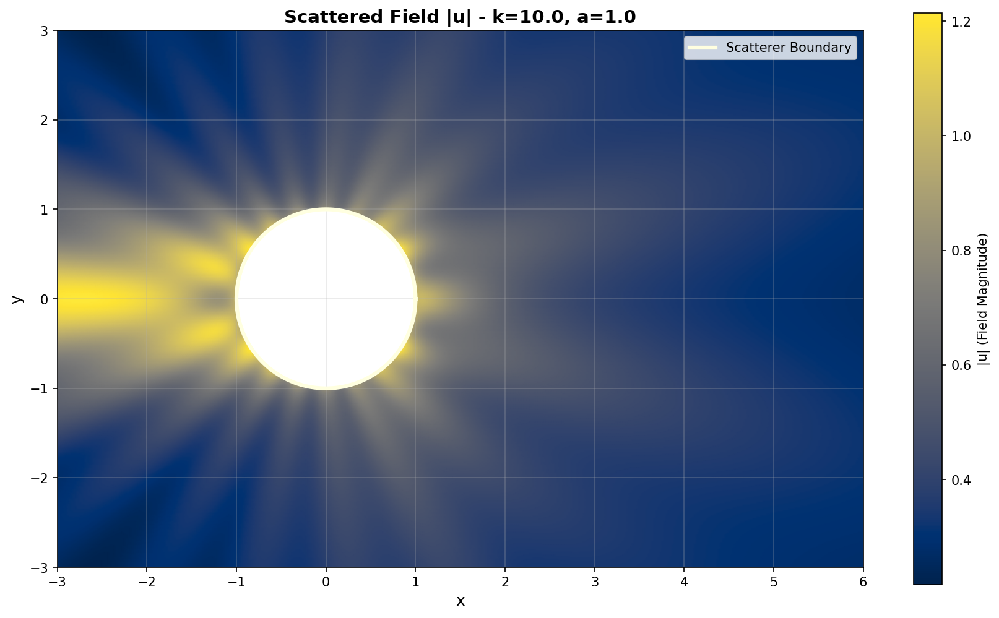
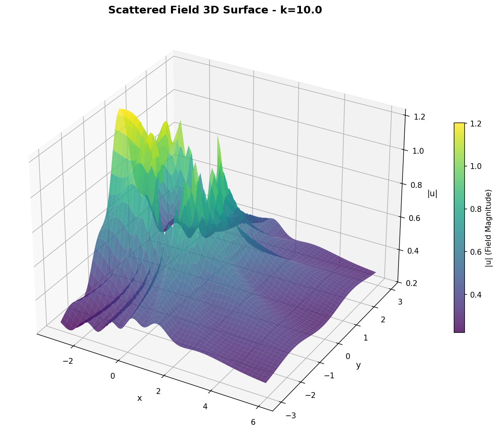
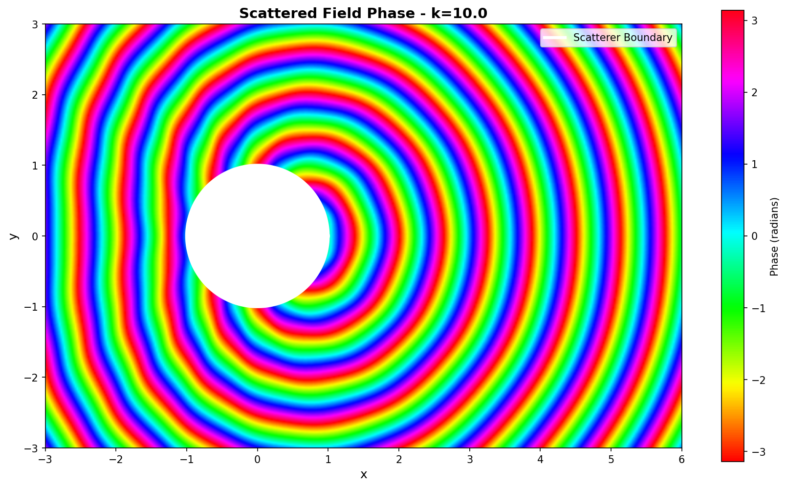

# Wave Scattering Around a Circular Obstacle

**Author:** Firas Boustila  
**Date:** October 2025  
**Language:** Python 
---

## 📋 Table of Contents

1. [Overview](#overview)
2. [Mathematical Formulation](#mathematical-formulation)
3. [Numerical Method](#numerical-method)
4. [Implementation Architecture](#implementation-architecture)
5. [Installation & Usage](#installation--usage)
6. [Class Descriptions](#class-descriptions)
7. [Results & Visualization](#results--visualization)

---

## Overview

This project implements a **Boundary Element Method (BEM)** solution for computing acoustic and electromagnetic wave scattering around a circular disc obstacle. The solution combines:

- **Helmholtz equation** for wave propagation
- **Green's function** for fundamental solutions
- **Fourier-Hankel series expansion** for boundary condition
- **Gauss-Legendre quadrature** for accurate numerical integration
- **Object-oriented design** for clean, maintainable code

### Physical Context

When an acoustic or electromagnetic wave encounters a circular obstacle, it scatters around it, creating a complex field pattern. This code computes the scattered field at arbitrary observation points using integral equation methods.

---

## Mathematical Formulation

### Helmholtz Equation

The time-harmonic wave equation is governed by:

$$\nabla^2 u + k^2 u = 0 \quad \text{(Helmholtz equation)}$$

where:
- $u(x,y)$ = complex-valued pressure/field amplitude
- $k = \omega/c = 2\pi/\lambda$ = wave number
- $\omega$ = angular frequency
- $c$ = wave speed (sound speed or light speed)

### Discretization Strategy

1. **Boundary mesh:** Divide circle into $N_b$ equal elements
2. **Constant density:** Assume $p$ is constant on each element (piecewise constant BEM)
3. **Quadrature points:** Compute midpoint of each segment
4. **Integration:** Use Gauss-Legendre quadrature to evaluate integrals

---

## Numerical Method

### Gauss-Legendre Quadrature

For accurate numerical integration, we use $n$-point Gauss-Legendre quadrature:

$$\int_{-1}^{1} f(x) \, dx \approx \sum_{i=1}^{n} w_i f(x_i)$$

where $x_i$ and $w_i$ are pre-computed nodes and weights.

**For line segments**, transform from $[-1, 1]$ to physical segment $[P_1, P_2]$:

$$\mathbf{\xi}(x) = \frac{1-x}{2} \mathbf{P}_1 + \frac{1+x}{2} \mathbf{P}_2$$

Then:
$$\int_{P_1}^{P_2} f(\mathbf{y}) \, ds = \frac{L}{2} \sum_{i=1}^{n} w_i f(\mathbf{\xi}(x_i))$$

where $L = |\mathbf{P}_2 - \mathbf{P}_1|$

### Algorithm (Boundary Element Method)

```
Input: Disc radius (a), wavenumber (k), grid points (X, Y)

1. Create boundary mesh:
   - Generate N_b uniformly-spaced points on circle
   - Compute segment endpoints and midpoints

2. Compute boundary conditions:
   - For each boundary midpoint (r=a, θ):
     - Evaluate Fourier-Hankel series
     - Get pressure values p_mid[j]

3. For each observation point (x_obs, y_obs):
   - Initialize field U = 0
   - For each boundary segment j:
     - Integrate Green's function: ∫ G(x_obs, y) ds(y)
     - Weight by pressure: multiply by p_mid[j]
     - Accumulate: U += integral × p_mid[j]
   - Store U(x_obs, y_obs)

Output: Field values at all observation points
```

### Computational Complexity

- **Time:** $O(N_b \times N_x \times N_y \times n_{quad})$
  - $N_b$ = boundary elements
  - $N_x, N_y$ = observation grid
  - $n_{quad}$ = quadrature points per segment

- **Space:** $O(N_x \times N_y)$

---

## Implementation Architecture

### Class Structure (OOP Design)

```
┌─────────────────────────────────────────────────────────┐
│               NumericalParameters                        │
│  (Configuration dataclass for all simulation parameters) │
└─────────────────────────────────────────────────────────┘
                           ▲
                           │
┌──────────────────────────────────────────────────────────┐
│           ScatteringSimulator                            │
│  ┌─────────────────────────────────────────────────────┐ │
│  │ • Initialize with NumericalParameters               │ │
│  │ • Compose: GreenFunction, CircularScatterer,        │ │
│  │   IncidentField                                     │ │
│  │ • compute_scattered_field()                         │ │
│  │ • plot_2d_field(), plot_3d_field(), ...            │ │
│  └─────────────────────────────────────────────────────┘ │
│              ▲            ▲              ▲               │
└──────────────┼────────────┼──────────────┼───────────────┘
               │            │              │
      ┌────────▼──┐  ┌──────▼────────┐  ┌─▼─────────────┐
      │GreenFn    │  │CircularScatt. │  │IncidentField  │
      │(k-value)  │  │(a, nodes)     │  │(a, k, N)      │
      └───────────┘  └───────────────┘  └───────────────┘
              │
              ├─► GaussLegendreQuadrature (static methods)
              └─► Hankel functions (via scipy)
```

### Key Classes

| Class | Purpose |
|-------|---------|
| `NumericalParameters` | Dataclass holding all simulation parameters |
| `GaussLegendreQuadrature` | Static methods for numerical integration |
| `GreenFunction` | Evaluates Green's function for given wavenumber |
| `CircularScatterer` | Manages boundary mesh and geometry |
| `IncidentField` | Computes boundary conditions via Fourier expansion |
| `ScatteringSimulator` | Main orchestrator - ties everything together |

---

## Installation & Usage

### Requirements

```bash
pip install numpy scipy matplotlib tqdm
```

### Python Version

Python 3.8+

### Running the Simulation

```python
from scattering_oop import NumericalParameters, ScatteringSimulator

# Define parameters
params = NumericalParameters(
    disc_radius=1.0,              # Disc radius (a)
    num_boundary_points=64,       # Boundary discretization
    wavenumber=10.0,              # Wave number (k)
    quad_order=7,                 # Gauss quadrature order
    num_fourier_modes=10,         # Fourier modes (±N)
    grid_nx=400,                  # Observation grid X
    grid_ny=400                   # Observation grid Y
)

# Create simulator
simulator = ScatteringSimulator(params)

# Compute field
simulator.compute_scattered_field()

# Visualize
simulator.plot_2d_field(save_path='field_2d.png')
simulator.plot_3d_field(save_path='field_3d.png')
simulator.plot_phase_field(save_path='phase.png')
```

### Command Line

```bash
python scattering.py
```

This runs the main() function with default parameters.

---

## Class Descriptions

### `NumericalParameters` (Dataclass)

Stores all configuration parameters for reproducibility:

```python
@dataclass
class NumericalParameters:
    disc_radius: float                # Obstacle radius (a)
    num_boundary_points: int          # Mesh refinement
    wavenumber: float                 # k = 2π/λ
    quad_order: int                   # Integration accuracy (2-7)
    num_fourier_modes: int            # Harmonic expansion range
    grid_nx: int                      # Observation grid resolution
    grid_ny: int
```

### `GaussLegendreQuadrature`

Static utility class for numerical integration:

- **Method:** `integrate_segment(func, p1, p2, order)`
  - Integrates arbitrary function over line segment
  - Transforms to physical coordinates
  - Applies Jacobian

### `GreenFunction`

Encapsulates Green's function evaluation:

```python
green = GreenFunction(k=10.0)
g_value = green.evaluate(x_obs, y_source)  # Returns complex value
```

### `CircularScatterer`

Manages boundary discretization:

- **Generates** uniformly-spaced nodes on circle
- **Computes** segment midpoints and angles
- **Stores** boundary geometry

### `IncidentField`

Boundary condition handler:

- **Expands** incident wave in Fourier-Hankel series
- **Computes** pressure on boundary at midpoints
- **Uses** pre-computed Hankel functions

### `ScatteringSimulator`

Main orchestrator class:

**Public Methods:**
- `compute_incident_field()` - Boundary pressure calculation
- `compute_scattered_field()` - Main BEM computation with progress bar
- `mask_interior()` - Prepare field for visualization
- `plot_2d_field()` - 2D magnitude plot
- `plot_3d_field()` - 3D surface visualization
- `plot_phase_field()` - Phase angle visualization

---

## Results & Visualization

### Output Files

The simulation generates 3 visualization files:

1. **`scattered_field_2d.png`**
   - 2D pseudocolor plot of field magnitude
   - Perceptually uniform 'cividis' colormap
   - Disc boundary overlay in yellow

2. **`scattered_field_3d.png`**
   - 3D surface plot showing wave interference patterns
   - Subsampled for performance
   - Better for understanding wave amplitudes

3. **`scattered_field_phase.png`**
   - Phase angle visualization (argument of complex field)
   - 'hsv' colormap for phase cycling
   - Shows wave fronts and interference patterns

### Interpretation

- **High magnitude regions:** Wave amplification (constructive interference)
- **Low magnitude regions:** Wave cancellation (destructive interference)
- **Phase discontinuities:** Wave fronts and scattering lobes
- **Diffraction pattern:** Shadow and bright regions depend on $ka$ (size parameter)

### Sample Results

**Default Configuration:** a=1.0, k=10.0, λ≈0.628, ka=10.0

#### 2D Field Magnitude Plot


*Figure 1: 2D pseudocolor plot showing scattered field magnitude |u| around the circular disc. The bright regions indicate constructive interference, while dark regions show destructive interference. The yellow circle marks the obstacle boundary.*

#### 3D Surface Visualization


*Figure 2: 3D surface representation of the scattered field magnitude. This perspective better shows amplitude variations and interference patterns. High peaks correspond to regions of wave amplification.*

#### Phase Field Visualization


*Figure 3: Phase angle of the complex scattered field (using HSV colormap). Phase discontinuities mark wave fronts and indicate the propagation direction of scattered waves. The cyclic nature of the phase shows multiple wavelengths in the far field.*

---

## Key Parameters Explained

| Parameter | Symbol | Range | Effect |
|-----------|--------|-------|--------|
| Disc Radius | $a$ | 0.5 - 2.0 | Obstacle size |
| Wavenumber | $k$ | 5 - 30 | Frequency (higher = more detail) |
| Boundary Points | $N_b$ | 32 - 256 | Mesh resolution |
| Fourier Modes | $N$ | 5 - 20 | Boundary accuracy |
| Quadrature Order | - | 2 - 7 | Integration accuracy |
| Grid Resolution | $N_x, N_y$ | 200 - 600 | Observation detail |

### Size Parameter

The key dimensionless number is **$ka$** (size parameter):
- $ka < 1$: Small obstacle, weak scattering
- $ka \sim 1$: Resonance effects
- $ka > 5$: Geometric optics regime, sharp shadows


**© 2025 Firas Boustila**

